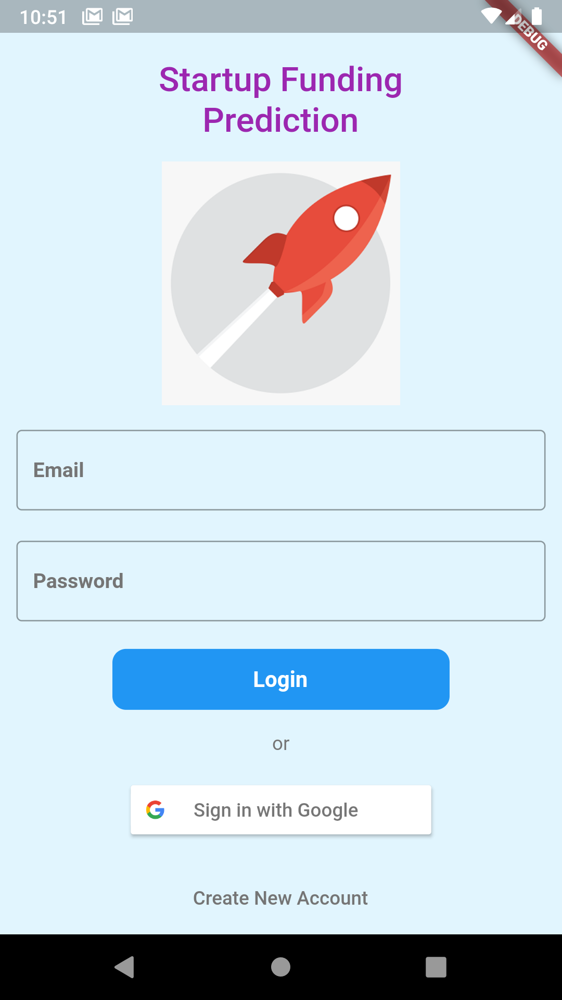
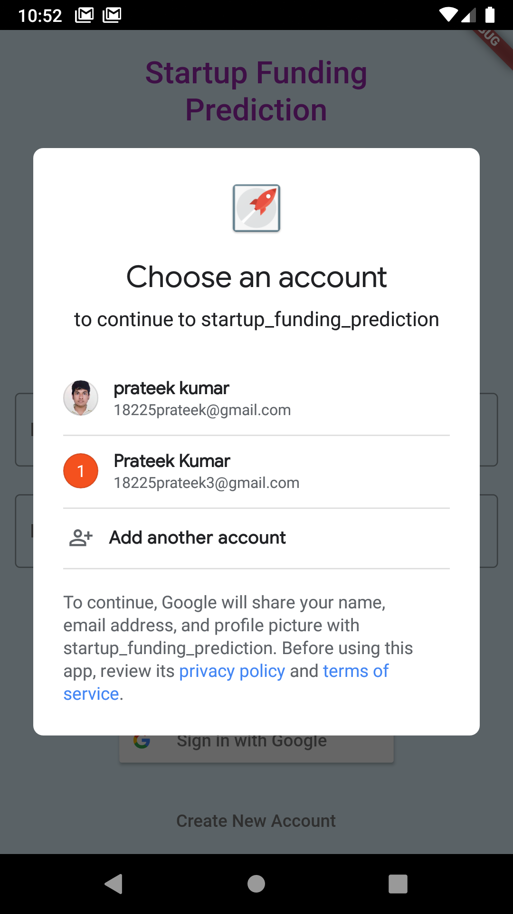
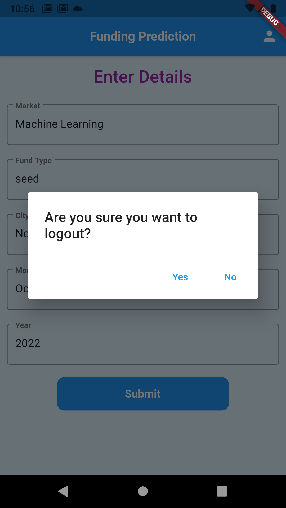
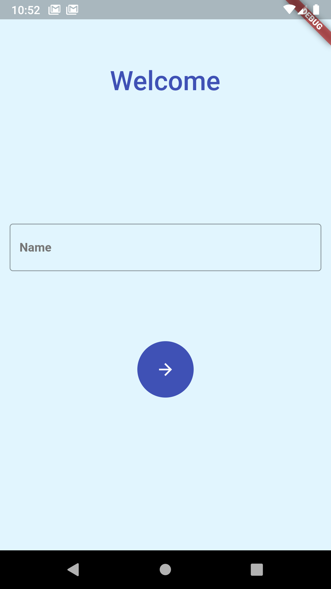
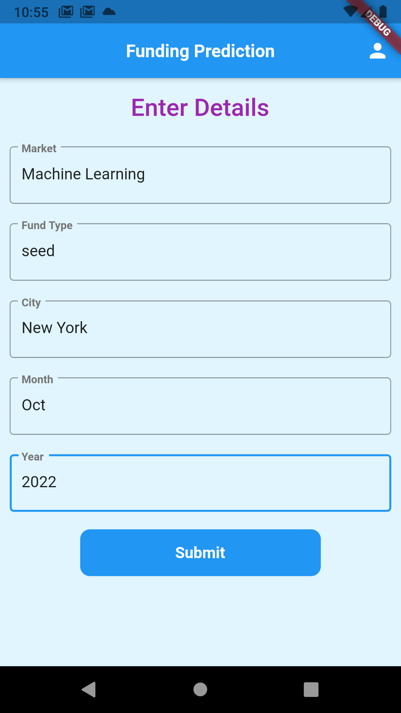
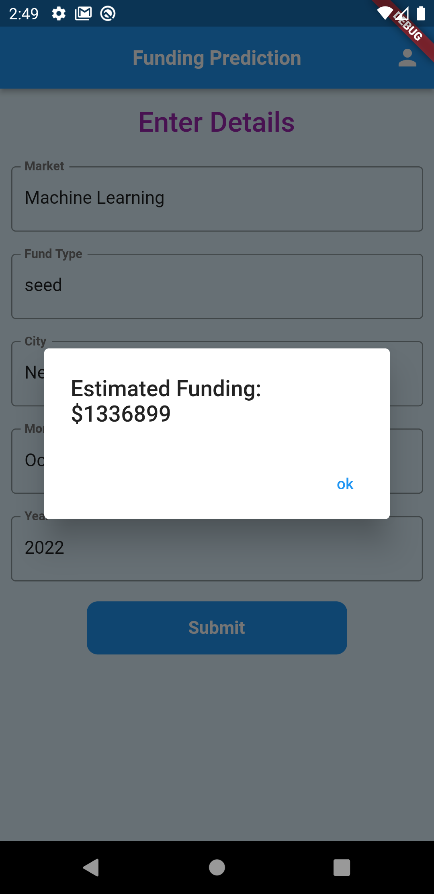

# startup_funding_prediction

An android app to predict startup funding using machine learning.

## Background

Given application is made as a part of internship in HCL Technologies under the guidance of Mr. Achyut Chandra sir.

## Tools

* Flutter
* Firebase
* Google Colab
* Azure Web Services

## Features

### Authentication

#### Login
   

#### Register
  

#### Machine Learnning Model(Xgboost Regressor) Prediction
   

## Links
[apk_link](https://drive.google.com/file/d/19oH_rOfgWs53bpxv0EzudkxStWoUX4XH/view?usp=sharing)

[ml_model_training_and_deployment](https://drive.google.com/drive/folders/1MSCOV8E2gHqNz2kE4Fn0UCIAgxnNrXWI?usp=sharing)
